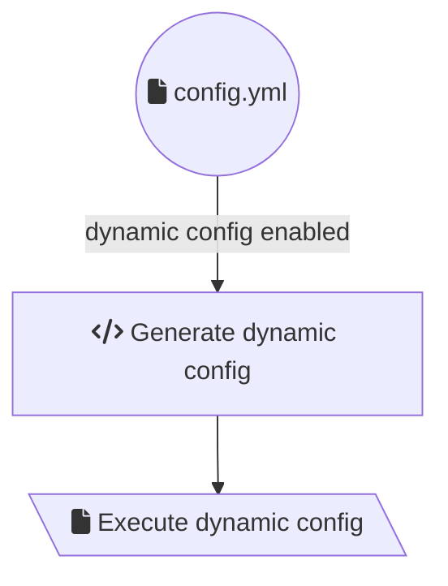

# 01 dynamic workflow Javascript

This example uses CircleCI's
[Dynamic Configuration](https://circleci.com/docs/2.0/dynamic-config/) feature,
which allows us to run any arbitrary config file at runtime. Our `config.yml`
file will be used to execute our Javascript config application, which will
generate a new `dynamicConfig.yml` file that will be executed.

The included `config.yml` file defines a workflow which will build our
JavaScript _config application_ (located in `.circleci/dynamic`) on every push
to our repository and then trigger a new workflow which has been generated by
the _config application_.

This pattern allows for _just-in-time_ config generation. You may find it useful
to check certain conditions at _compile-time_ to determine programmatically if
you wish to include certain jobs or workflows, such as based on the day of the
week, or conditionally based on an external remote service / API.

**Tip:** Ensure you have enabled "setup workflows", the Dynamic configuration
feature on CircleCI must be manually enabled currently per-project.
https://circleci.com/docs/2.0/dynamic-config/#getting-started-with-dynamic-config-in-circleci
